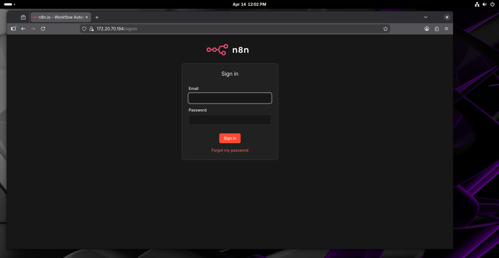
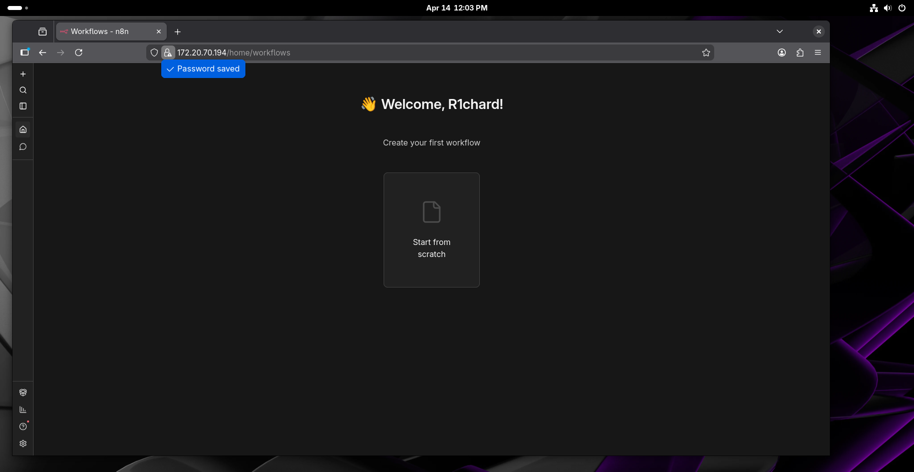

# 01 — n8n Installation

## Overview
n8n is deployed as a Docker container behind an nginx reverse proxy with a self-signed TLS certificate. This ensures all traffic is encrypted and n8n is never directly exposed to the network.

## Architecture
Network → nginx (443/HTTPS) → n8n (internal:5678)

## Requirements
- Docker 29.x+
- Docker Compose
- openssl

## Stack

| Component | Version | Role |
|-----------|---------|------|
| n8n | 2.16.0 | Workflow automation engine |
| nginx | alpine | Reverse proxy + TLS termination |

## Folder Structure
n8n-docker/
├── docker-compose.yml
├── nginx/
│   ├── nginx.conf
│   └── ssl/
│       ├── n8n.crt
│       └── n8n.key

## Step 1 — Create folder structure

```bash
mkdir -p ~/n8n-docker/nginx/ssl
cd ~/n8n-docker
```

## Step 2 — Generate self-signed TLS certificate

```bash
openssl req -x509 -nodes -days 365 -newkey rsa:2048 \
  -keyout ~/n8n-docker/nginx/ssl/n8n.key \
  -out ~/n8n-docker/nginx/ssl/n8n.crt \
  -subj "/C=PT/ST=Lisboa/L=Lisboa/O=HomeLab/CN=172.20.70.194"
```

## Step 3 — nginx configuration

```nginx
server {
    listen 80;
    server_name 172.20.70.194;
    return 301 https://$host$request_uri;
}

server {
    listen 443 ssl;
    server_name 172.20.70.194;

    ssl_certificate /etc/nginx/ssl/n8n.crt;
    ssl_certificate_key /etc/nginx/ssl/n8n.key;

    ssl_protocols TLSv1.2 TLSv1.3;
    ssl_ciphers HIGH:!aNULL:!MD5;
    ssl_prefer_server_ciphers on;

    location / {
        proxy_pass http://n8n:5678;
        proxy_http_version 1.1;
        proxy_set_header Upgrade $http_upgrade;
        proxy_set_header Connection "upgrade";
        proxy_set_header Host $host;
        proxy_set_header X-Real-IP $remote_addr;
        proxy_set_header X-Forwarded-For $proxy_add_x_forwarded_for;
        proxy_set_header X-Forwarded-Proto $scheme;
    }
}
```

## Step 4 — docker-compose.yml

```yaml
services:
  n8n:
    image: docker.n8n.io/n8nio/n8n
    container_name: n8n
    restart: unless-stopped
    environment:
      - N8N_HOST=172.20.70.194
      - N8N_PORT=5678
      - N8N_PROTOCOL=https
      - WEBHOOK_URL=https://172.20.70.194/
      - N8N_SECURE_COOKIE=true
    volumes:
      - n8n_data:/home/node/.n8n

  nginx:
    image: nginx:alpine
    container_name: nginx
    restart: unless-stopped
    ports:
      - "80:80"
      - "443:443"
    volumes:
      - ./nginx/nginx.conf:/etc/nginx/conf.d/default.conf:Z
      - ./nginx/ssl:/etc/nginx/ssl:Z
    depends_on:
      - n8n

volumes:
  n8n_data:
```

## Step 5 — Start containers

```bash
sudo docker compose up -d
sudo docker ps
```

## Known Limitations

- Self-signed certificate will show a browser security warning — expected in a lab environment
- Python task runner unavailable in this image — does not affect this workflow as only HTTP Request and JavaScript nodes are used

## Access
https://172.20.70.194

## Screenshots



