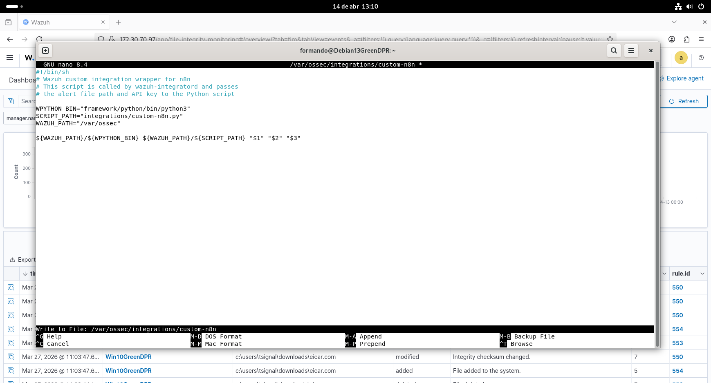
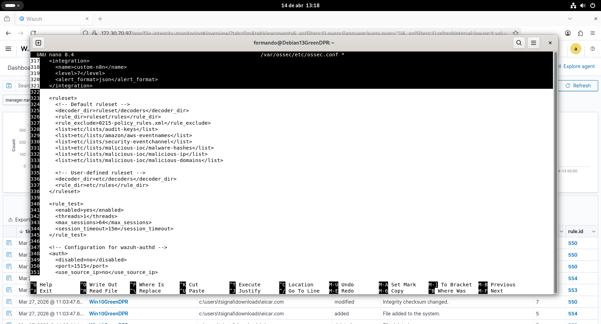

markdown# 02 — Wazuh Custom Integration

## Overview
Custom integration that forwards Wazuh alerts to n8n via HTTP POST.
Only triggers on FIM rules 100200 and 100201 (file modified/added in /root).

## Architecture
Wazuh integratord → custom-n8n (shell) → custom-n8n.py → n8n webhook

## Files Created

| File | Location | Purpose |
|------|----------|---------|
| `custom-n8n` | `/var/ossec/integrations/` | Shell wrapper called by integratord |
| `custom-n8n.py` | `/var/ossec/integrations/` | Python script that POSTs alert to n8n |

## Step 1 — Create shell wrapper

```bash
sudo nano /var/ossec/integrations/custom-n8n
```

```bash
#!/bin/sh
WPYTHON_BIN="framework/python/bin/python3"
SCRIPT_PATH="integrations/custom-n8n.py"
WAZUH_PATH="/var/ossec"
${WAZUH_PATH}/${WPYTHON_BIN} ${WAZUH_PATH}/${SCRIPT_PATH} "$1" "$2" "$3"
```

## Step 2 — Create Python script

```bash
sudo nano /var/ossec/integrations/custom-n8n.py
```

```python
#!/usr/bin/env python3
import sys
import json
import requests
import urllib3

urllib3.disable_warnings(urllib3.exceptions.InsecureRequestWarning)

N8N_WEBHOOK_URL = "https://YOUR_N8N_IP/webhook/wazuh-alert"

def main():
    alert_file_path = sys.argv[1]
    with open(alert_file_path) as alert_file:
        alert = json.load(alert_file)

    payload = {
        "rule_id":    alert.get("rule", {}).get("id", "N/A"),
        "rule_desc":  alert.get("rule", {}).get("description", "N/A"),
        "level":      alert.get("rule", {}).get("level", 0),
        "src_ip":     alert.get("data", {}).get("srcip", "N/A"),
        "agent_name": alert.get("agent", {}).get("name", "N/A"),
        "agent_ip":   alert.get("agent", {}).get("ip", "N/A"),
        "timestamp":  alert.get("timestamp", "N/A"),
        "full_alert": alert
    }

    response = requests.post(
        N8N_WEBHOOK_URL,
        json=payload,
        verify=False,
        timeout=10
    )
    print(f"n8n response: {response.status_code}")

if __name__ == "__main__":
    main()
```

## Step 3 — Set permissions

```bash
sudo chmod 750 /var/ossec/integrations/custom-n8n
sudo chmod 750 /var/ossec/integrations/custom-n8n.py
sudo chown root:wazuh /var/ossec/integrations/custom-n8n
sudo chown root:wazuh /var/ossec/integrations/custom-n8n.py
```

## Step 4 — Configure ossec.conf

Add inside `<ossec_config>` before the closing tag:

```xml
<!-- VirusTotal Integration -->
<integration>
  <name>virustotal</name>
  <api_key>YOUR_VIRUSTOTAL_API_KEY</api_key>
  <group>syscheck</group>
  <level>7</level>
  <alert_format>json</alert_format>
</integration>

<!-- n8n SOAR Integration -->
<integration>
  <name>custom-n8n</name>
  <rule_id>100200,100201</rule_id>
  <alert_format>json</alert_format>
</integration>
```

## Step 5 — Restart Wazuh

```bash
sudo systemctl restart wazuh-manager
sudo grep -a "custom-n8n" /var/ossec/logs/ossec.log
```

Expected output:
INFO: Enabling integration for: 'custom-n8n'

## FIM Configuration

Added to `/var/ossec/etc/ossec.conf` syscheck section:

```xml
<directories check_all="yes" report_changes="yes" realtime="yes">/root</directories>
```

## Known Issues & Fixes

| Issue | Cause | Fix |
|-------|-------|-----|
| `Output: Exception` | Non-FIM alerts sent to VirusTotal | Add `<group>syscheck</group>` filter |
| Duplicate integration block | Copy/paste error in ossec.conf | Remove duplicate, use XML comments only |
| `#` comments in XML | Invalid XML syntax | Replace with `<!-- -->` style comments |

## Screenshots


