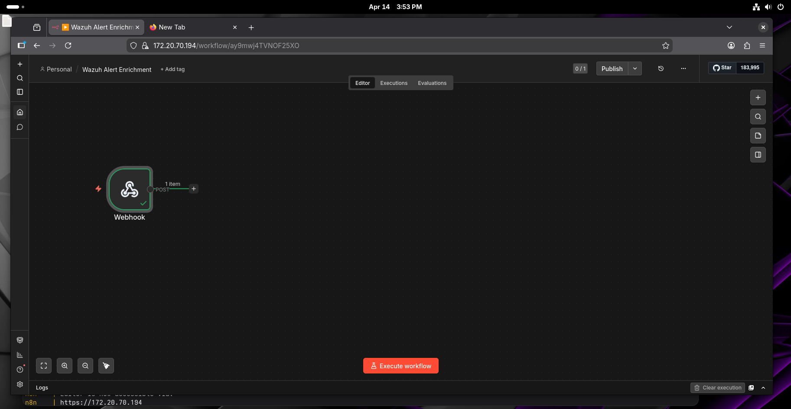
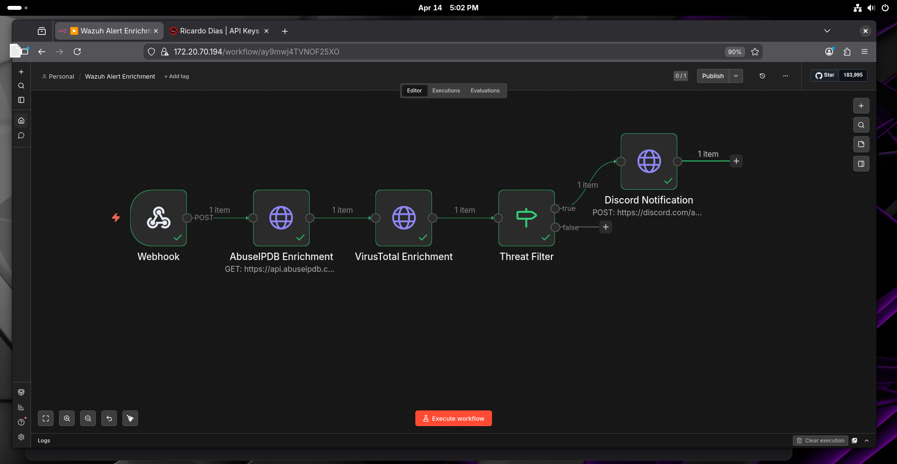
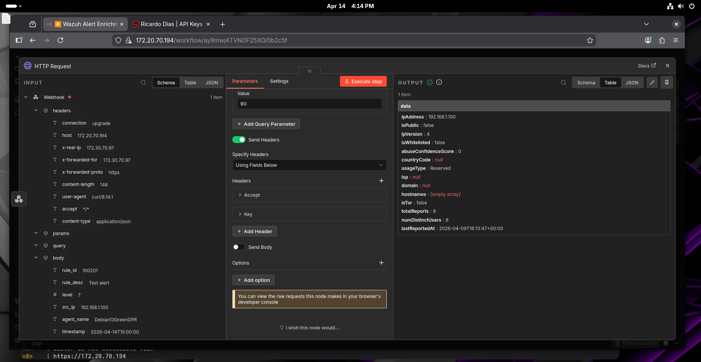
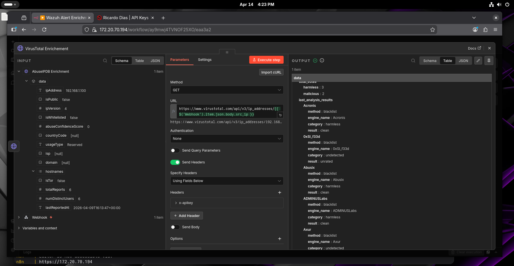
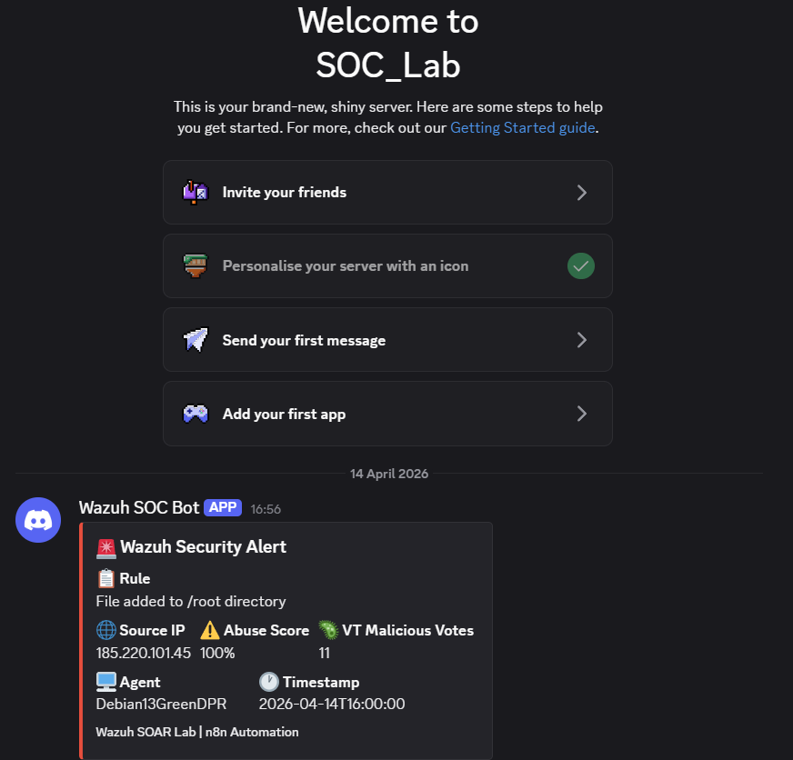
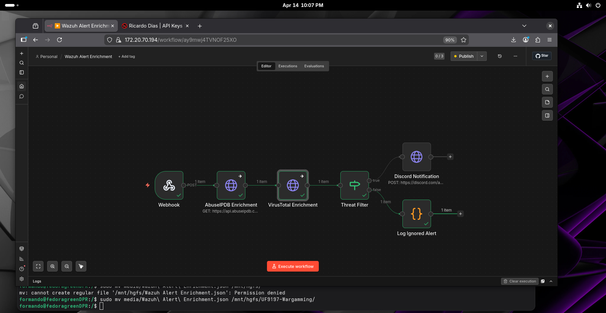

# 03 — n8n Workflow: Wazuh Alert Enrichment

## Overview
n8n workflow that receives Wazuh alerts, enriches the source IP with
AbuseIPDB and VirusTotal, filters by threat score, and sends a
formatted notification to Discord.

## Workflow Architecture
Webhook → AbuseIPDB Enrichment → VirusTotal Enrichment → Threat Filter → Discord Notification

## Nodes

| Node | Type | Purpose |
|------|------|---------|
| Webhook | Trigger | Receives POST requests from Wazuh |
| AbuseIPDB Enrichment | HTTP Request | Queries AbuseIPDB API for IP reputation |
| VirusTotal Enrichment | HTTP Request | Queries VirusTotal API for IP analysis |
| Threat Filter | IF | Only forwards alerts with abuse score > 0 |
| Discord Notification | HTTP Request | Sends enriched alert to Discord channel |

## Step 1 — Create Webhook node

- **Type:** Webhook
- **HTTP Method:** POST
- **Path:** `wazuh-alert`
- **Authentication:** None
- **Respond:** Immediately

Production URL:
https://YOUR_N8N_IP/webhook/wazuh-alert

## Step 2 — AbuseIPDB Enrichment node

- **Type:** HTTP Request
- **Method:** GET
- **URL:** `https://api.abuseipdb.com/api/v2/check`

Query Parameters:

| Name | Value |
|------|-------|
| `ipAddress` | `{{ $json.body.src_ip }}` |
| `maxAgeInDays` | `90` |

Headers:

| Name | Value |
|------|-------|
| `Accept` | `application/json` |
| `Key` | `YOUR_ABUSEIPDB_API_KEY` |

> Settings → Enable **"Continue on Fail"** to handle rate limits gracefully.

## Step 3 — VirusTotal Enrichment node

- **Type:** HTTP Request
- **Method:** GET
- **URL:** `https://www.virustotal.com/api/v3/ip_addresses/{{ $('Webhook').item.json.body.src_ip }}`

Headers:

| Name | Value |
|------|-------|
| `x-apikey` | `YOUR_VIRUSTOTAL_API_KEY` |

> Settings → Enable **"Continue on Fail"** to handle rate limits gracefully.

## Step 4 — Threat Filter node

- **Type:** IF
- **Condition:** `{{ $('AbuseIPDB Enrichment').item.json.data.abuseConfidenceScore }}` greater than `0`

> True branch → Discord Notification
> False branch → workflow ends silently

## Step 5 — Discord Notification node

- **Type:** HTTP Request
- **Method:** POST
- **URL:** `YOUR_DISCORD_WEBHOOK_URL`
- **Body Content Type:** JSON

```json
{
  "embeds": [{
    "title": "🚨 Wazuh Security Alert",
    "color": 15158332,
    "fields": [
      {
        "name": "📋 Rule",
        "value": "{{ $('Webhook').item.json.body.rule_desc }}",
        "inline": false
      },
      {
        "name": "🌐 Source IP",
        "value": "{{ $('Webhook').item.json.body.src_ip }}",
        "inline": true
      },
      {
        "name": "⚠️ Abuse Score",
        "value": "{{ $('AbuseIPDB Enrichment').item.json.data.abuseConfidenceScore }}%",
        "inline": true
      },
      {
        "name": "🦠 VT Malicious Votes",
        "value": "{{ $('VirusTotal Enrichment').item.json.data.attributes.total_votes.malicious }}",
        "inline": true
      },
      {
        "name": "🖥️ Agent",
        "value": "{{ $('Webhook').item.json.body.agent_name }}",
        "inline": true
      },
      {
        "name": "🕐 Timestamp",
        "value": "{{ $('Webhook').item.json.body.timestamp }}",
        "inline": true
      }
    ],
    "footer": {
      "text": "Wazuh SOAR Lab | n8n Automation"
    }
  }]
}
```


## Step 6 - False Branch — Log Ignored Alert node

Alerts that don't meet the threat threshold (abuse score = 0) are
logged silently instead of being discarded — maintaining a complete
audit trail of all processed alerts.

- **Type:** Code (JavaScript)
- **Branch:** Threat Filter → false

```javascript
const alert = $('Webhook').item.json.body;

console.log(`[IGNORED] ${alert.timestamp} | Rule: ${alert.rule_id} | IP: ${alert.src_ip} | Agent: ${alert.agent_name}`);

return {
  status: "ignored",
  reason: "abuse_score_below_threshold",
  rule_id: alert.rule_id,
  src_ip: alert.src_ip,
  agent_name: alert.agent_name,
  timestamp: alert.timestamp
};
```

> This ensures every alert is accounted for — either escalated to
> Discord or logged as low risk. No alert is silently dropped.

## Step 7 — Publish workflow

Click **"Publish"** at the top right to activate the workflow in
production mode — it will now run automatically without test mode.

## Rate Limiting Notes

| API | Free Tier Limit | Mitigation |
|-----|----------------|------------|
| AbuseIPDB | 1,000 requests/day | Enable "Continue on Fail", filter by rule_id in Wazuh |
| VirusTotal | 500 requests/day | Enable "Continue on Fail", filter by rule_id in Wazuh |

## Testing

Test with a known malicious IP using curl from the Wazuh VM:

```bash
curl -k -X POST https://YOUR_N8N_IP/webhook-test/wazuh-alert \
  -H "Content-Type: application/json" \
  -d '{
    "rule_id":"100201",
    "rule_desc":"File added to /root directory",
    "level":7,
    "src_ip":"185.220.101.45",
    "agent_name":"Debian13GreenDPR",
    "timestamp":"2026-04-14T16:00:00"
  }'
```

Expected Discord output:
- 🚨 Alert title
- Source IP: 185.220.101.45
- Abuse Score: 100%
- VT Malicious Votes: 11
- Agent: Debian13GreenDPR

## Screenshots






